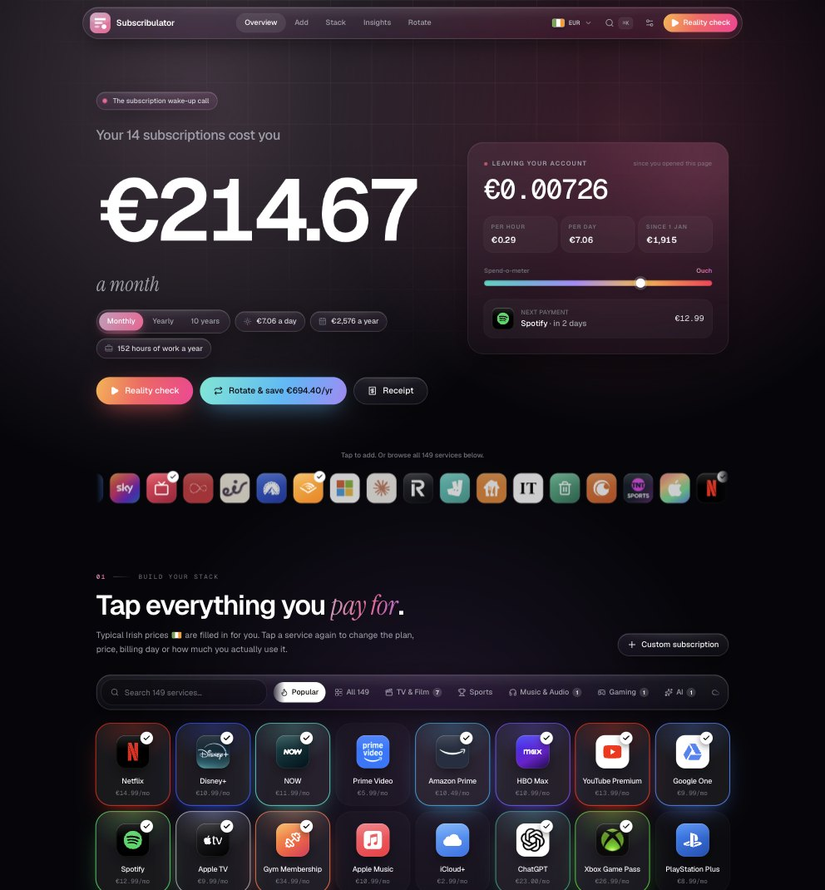

# Subscribulator

**The subscription wake-up call.** Tap every subscription you pay for, watch the monthly and yearly totals climb, then see how much you'd keep by rotating similar services instead of paying for them all at once.

**Live at [subscribulator.eu](https://subscribulator.eu)** · [Support it on Ko-fi](https://ko-fi.com/anpaorach)



## Features

- **Country picker** (defaults to Ireland): researched prices for Ireland, the UK and the US, estimates for eight more countries, local services (eir, NOW, Hulu, Stan…), local comparisons, and one-tap re-pricing of your stack.
- **Logo wall** with 170 services (local prices, plan tiers, billing cycles), search, categories, a ⌘K palette and custom subscriptions.
- **Live totals**: rolling monthly, yearly and 10-year numbers, a per-second "money leaving your account" ticker, and a background that heats up as your spend grows.
- **Reports**: physics bubble chart, category donut, investment "time machine", real-life equivalents, billing calendar (drag to set billing days), tips, and a "Worth it?" cost-per-use zombie detector.
- **Rotation planner**: groups similar services (TV & film, music, gaming, AI…), lets you choose how many to keep at once and how often to switch, shows a 12-month timeline and this month's keep/pause list, and exports switch reminders as an `.ics` calendar file.
- **Reality check** story mode and a shareable receipt (PNG export).

Everything is stored in the browser's localStorage; nothing is sent to a server. Export and import live in the settings menu.

## Run it locally

```bash
npm install
npm run dev        # http://localhost:5190
```

Needs Node 20.19 or newer (`.node-version` pins Node 24). Other scripts:

| Script | What it does |
| --- | --- |
| `npm run build` | Typecheck and build the static site into `dist/` |
| `npm run preview:cloudflare` | Build, then serve it locally in Cloudflare's runtime |
| `npm run deploy` | Build and publish to Cloudflare |
| `npm run lint` | Lint with Oxlint |

## Deploying

It's a static site, ready for Cloudflare Workers: `npx wrangler login`, then `npm run deploy`. [DEPLOY-CLOUDFLARE.md](./DEPLOY-CLOUDFLARE.md) has the full guide: automatic deploys from GitHub, and connecting subscribulator.eu from GoDaddy.

The Ko-fi link is set in `src/config.ts`. A `VITE_KOFI_URL` build variable overrides it, and an empty one hides the support section.

## Customising

| What | Where |
| --- | --- |
| Services and plans | `src/data/catalog.ts` |
| Local prices, availability and each country's popular list | `src/data/regional.ts` |
| Countries, currencies and formatting | `src/lib/money.ts` |
| Rotation groups and categories | `src/data/categories.ts` |
| Sample stack | `src/data/sample.ts` |
| Ko-fi link | `src/config.ts` |
| App icons | `python3 scripts/make-icons.py` (needs Pillow) |

## Built with

React 19 with the React Compiler, Vite 8 (Rolldown), TypeScript, Tailwind CSS 4, Motion, NumberFlow, Radix UI, cmdk, Sonner, d3 and Zustand.

Brand logos come from [Simple Icons](https://simpleicons.org) (CC0), plus app icons for brands Simple Icons doesn't carry (`src/assets/logos`, made with `python3 scripts/fetch-logos.py`). All brand names and logos belong to their owners and are only used to identify each service. Prices are typical local prices and change often.
